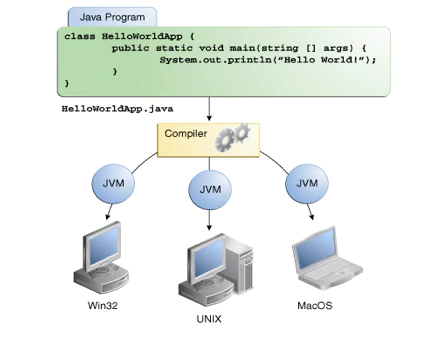

## Où trouver Java

Bienvenu dans le monde de java. C'est un langage de programmation orienté objet crée en 1995 par la société Sun.
Suite au rachat de Sun par la société Oracle, pour des raisons de licence plusieurs implémentations de Java sont apparues.
L'implémentation qui nous intéresse est l'OpenJDK. Nous pouvons la télécharger entre autre chez Oracle, ReadHat, Microsoft.  
Ensuite vient la notion de JDK ou JRE. Pour un développeur c'est la JDK qu'il faut. Nous verrons plus tard les spécificités de chacune.  

## La JVM

Une de ses caractéristiques principales est la JVM : Java Virtual Machine.  
C'est une couche qui permet à un même programme Java de tourner sur différents systèmes d'exploitation.



Lorsqu'un développeur (vous!) souhaite installer Java sur sa machine, il installe l'OpenJDK.
Cette installation comprend des bibliothèques standards, un environnement de compilation et un environnement d'exécution.  
La dernière version sortie du JDK est la 15. ([plus de détail sur les versions](https://fr.wikipedia.org/wiki/Java_%28langage%29#Contenu_et_%C3%A9volutions)).  
Dans votre ancienne vie en temps qu'utilisateur, vous avez sûrement télécharger la JRE sur votre PC. Il s'agit d'une JVM pour un environnement d'exécution. Il n'est pas possible de compiler.

## Utilisation de Java

* Java est un langage à la fois robuste (grâce à des règles de compilation strictes, vous en ferez vite l'expérience) et sa syntaxe permet d'implémenter des concepts élaborés (plus simplement qu'en c++).
* Java est un vrai langage multi-thread qui utilise toutes les capacités d'un processeur multi-coeur.
* C'est un langage très largement répandu, je n'ai pas trouvé à combien de [sloc](https://en.wikipedia.org/wiki/Source_lines_of_code#Example) il était estimé.
* Java possède de nombreuses bibliothèques et frameworks.
* Java possède une large communauté d'utilisateurs et de nombreux programmes déjà écrits, si bien qu'une solution existe souvent pour un besoin donné.
* Java en surtout utilisé pour ses capacités de backend, ainsi que sur Android.
* Java c'est aussi Minecraft.

## Voici à quoi ressemble un programme java

Fichier HelloWorld.java

```java
public class HelloWorld {
  public static void main(String[] args) {
    System.out.println("Hello everybody!");
  }
}
```

Le nom du fichier est le nom de la classe (ici HelloWorld) avec l'extension .java.
Comme on peut le voir, ce fichier est écrit de façon _compréhensible_.
Il va ensuite être compilé en bytecode (écrit en octets) qui sera interprété par la jvm : java est donc un langage compilé et interprété.

## Tester des instructions avec jshell

Depuis Java 1.8, on peut simplement tester du code java en lançant jshell.
jshell est un REPL, c'est à dire qu'il permet d'exécuter du code en ligne de commande sans lancer de compilation. REPL est très utilisé en Python par exemple.

```sh
jshell> System.out.println("Hello World!");
Hello World!
```
